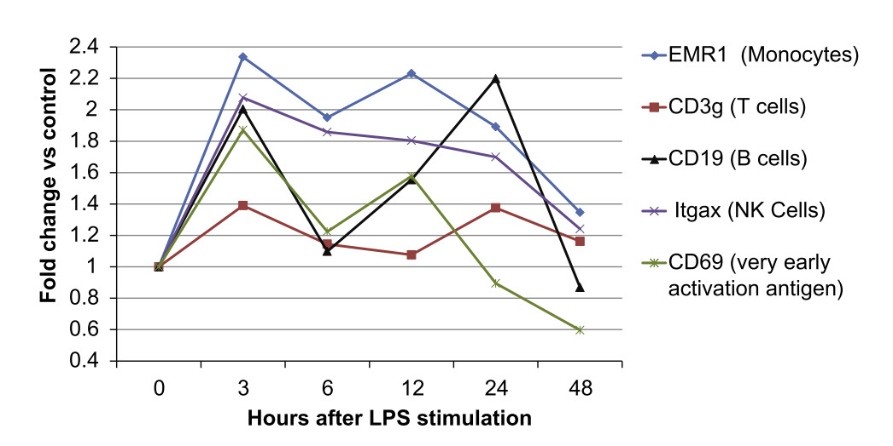

## Motivation

>- Often transcript profiling (microarray, RNA-Seq, etc) experiment are
   conducted, and "differentially expressed" genes are determined based on 
   thresholds for:
    1. Fold change (FC)
    2. p-value
>- Setting a minimum p-value makes sense, but what about the FC requirement?
   There are several possible reasons for setting a minumum fold change.
>- There are at least a couple reasons this is done:
    1. Noisy data collection (ligation, amplification, imperfect sampling)
    2. Assumption that most interested biological effects will involve large
       increases/decreases in transcript levels.
>- However:
    * Are these valid assumptions?
    * What effect do these thresholds have on the loss of biological 
      information?

---

## Approach

--- .segue .dark

## Results

---

## Results

Figure 1: Example fold changes for markers of early immune response

---

## Question: Which statistical methods work best for detecting low FC genes?

### Approach
>1. Compared performance of six different methods for detecting genes with < 2
FC:
    - edgeR
    - t-test
    - DESeq
    - baySeq
    - Welch's test
    - NOIseq
>2. Performance metric: Enrichment of a subset of
the 23 inflammation-related GO categories.
    * For each method, sorted genes by p-value, selected top 2000 genes, and
      selected upregulated genes with FC < 2.
    * GO enrichment evaluated using the Fisher exact test, adjusted for
      multiple testing with the Benjamini-Hochberg correction.
    * Control: randomized timepoints

---

## Question: Which statistical methods work best for detecting low FC genes?

### Result

>1. Overall, methods all performed pretty similarly:
    - Number genes
        * 355 (DESeq)
        * 410 (edgeR)
    - p-value (Immune system response)
        * 4.36E-41 (baySeq)
        * 3.91E-47 (t-test)
>2. Best method, however: Keep any gene found by at least one of the methods
    - 631 genes
    - p-value: <1E-50
>3. Conclusion: Existing methods are sufficient to
    detect biologically meaningful enrichment at low FC.

---

## References

<!-- Custom JavaScript -->

