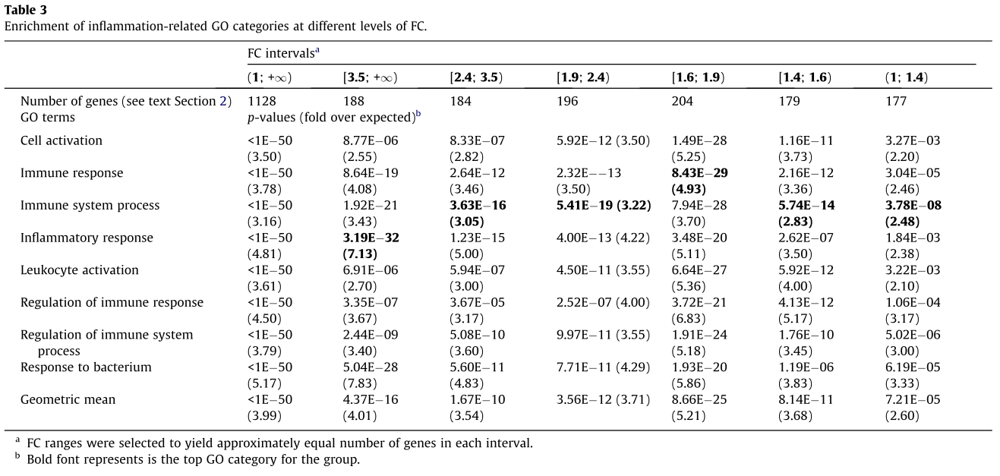
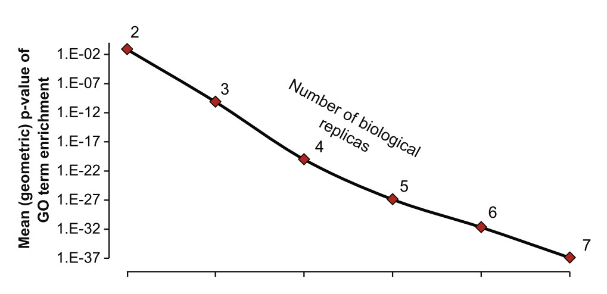
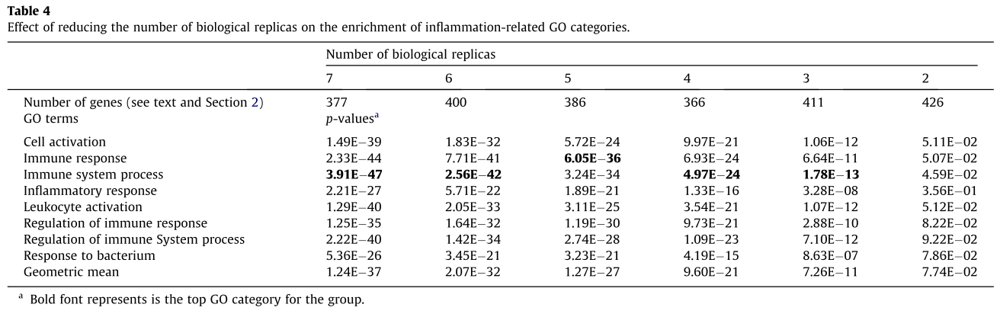

## Overview

>- Used data from a previous study involving a time-course inflammation response
with single-molecule sequencing (SMS) RNA-Seq.
    * LPS stimulation of mice
    * Control + 5 time-points
    * 7 replicates (individual mice) per condition
>- Interested in looking at contribution of low FC genes and their biological
  relevance.

---

## Motivation

>- Often transcript profiling (microarray, RNA-Seq, etc) experiment are
   conducted, and "differentially expressed" genes are determined based on 
   thresholds for:
    1. Fold change (FC)
    2. p-value
>- Setting a minimum p-value makes sense, but what about the FC requirement?
   There are several possible reasons for setting a minumum fold change.
>- There are at least a couple reasons this is done:
    1. Noisy data collection (ligation, amplification, imperfect sampling)
    2. Assumption that most interested biological effects will involve large
       increases/decreases in transcript levels.
>- However:
    * Are these valid assumptions?
    * What effect do these thresholds have on the loss of biological 
      information?

--- .segue .dark

## Results

---

## Question 1: How often are p-value and/or FC cutoffs applied?

### Approach
>- Pulled 40 most recent papers in PubMed for query "microarray expression
   profiling" (...It would be interesting to know results for "RNA-Seq")

### Result
>- At least 50% of studied applied a FC cutoff (the rest used p-values only)
>- This means that any biologically relevant DE genes below the FC cutoff
   will be missed.

---

## Question 2: What is the average fold change cutoff used?

### Approach
>- Sampled 10 papers for which FC filtering was used.

### Result
>- Papers used a cutoff of either 1.5 or 2.0. ($\mu = 1.725$)
>- Authors also suggest, however, that based on MAQC study results, microarrays
   tend to underestimate the actual FC compared with qRTPCR (Canales et al. 
   2006).
>- Adjusted microarray cutoff likely closer to 3.45.

---

## Question 3: How much of the biologically significant differentially expressed genes have low FC?

### Approach
>- Looked at data from inflammation time course SMS RNA-Seq study.
>- Compared control and 3hr mice using Student's t-test. Genes with increased
   expression and p-value <= 0.01 treated as DE.
    * 1419 genes
>- Filtered list for genes with inflammation-related GO annotations
    * Used 23 such GO categories shown to be statistically enriched, e.g. "Cell
      activation", "Cytokine production", "Regulation of Cytokine production",
      "Immune System Process", etc.
    * 640 genes remaining after filtering.

---

## Question 3: How much of the biologically significant differentially expressed genes have low FC?

### Result
>- Median FC: 1.91-fold
>- More than half of the genes (344/640) were upregulated 
   by less than 2-fold
>- Estimated FDR for 640 genes: 8.6%.
>- 59 genes with FC 5x and 15 genes with 10x FC
>- Using adjusted microarray FC cutoff, this would mean that ~83% of actual
   DE genes would be missed.

---

Figure 1: Example fold changes for markers of early immune response

---

## Question 4: Which statistical methods work best for detecting low FC genes?

### Approach
>1. Compared performance of six different methods for detecting genes with < 2
FC:
    - edgeR
    - t-test
    - DESeq
    - baySeq
    - Welch's test
    - NOIseq
>2. Performance metric: Enrichment of a subset of
the 23 inflammation-related GO categories.
    * For each method, sorted genes by p-value, selected top 2000 genes, and
      selected upregulated genes with FC < 2.
    * GO enrichment evaluated using the Fisher exact test, adjusted for
      multiple testing with the Benjamini-Hochberg correction.
    * Control: randomized timepoints

---

## Question 4: Which statistical methods work best for detecting low FC genes?

### Result

>1. Overall, methods all performed pretty similarly:
    - Number genes
        * 355 (DESeq)
        * 410 (edgeR)
    - p-value (Immune system response)
        * 4.36E-41 (baySeq)
        * 3.91E-47 (t-test)
>2. Best method, however: Keep any gene found by at least one of the methods
    - 631 genes
    - p-value: <1E-50
>3. Conclusion: Existing methods are sufficient to
    detect biologically meaningful enrichment at low FC.

---

## Question 5: How low of an FC is relevant?

### Approach

>1. Took top 2000 DE transcripts found in any of the 5 statistical methods
    tested.
>2. Sorted genes by FC and split into six  ~equal-sized groups:
    * 1 - 1.4 (177 genes)
    * 1.4 - 1.6 (179 genes)
    * 1.6 - 1.9 (204 genes)
    * 1.9 - 2.4 (196 genes)
    * 2.4 - 3.5 (184 genes)
    * 3.5+ (188 genes)

>3. Tested each group for enrichment.

---

## Question 5: How low of an FC is relevant?

### Result

>1. FC >= 3.5 ha most significant p-value for "Inflammatory response" 
    (p=$3.2 x 10^-32$), however,
>2. For other GO terms, lower FC groups had higher enrichment.

---

Table 3: Enrichment of inflammation-related GO categories vs. FC level

1. Group with most significant mean p-value across the seven GO terms is
   the 1.6-1.9 fold change group.
2. Even the group with the lowest fold change (1-1.4) has fairly significant
   enrichment for some GO terms.

---

## Question 6: What is the effect of having less replicates on detecting low FC DE genes?

### Approach
>1. Starting with 7 replicates (inidividual mice) in control and 3h time points,
    progressively removed 1 replicate.
>2. Proceeded until 2 replicates for each condition remained.
>3  Measured effect on power to detect low FC DE genes.

---

## Question 6: What is the effect of having less replicates on detecting low FC DE genes?

Figure 2. Number of replicates vs. enrichment of inflammation-related GO terms
for transcripts with less than 2 FC.

---

## Question 6: What is the effect of having less replicates on detecting low FC DE genes?

Table 4. Effect of reducing replicates on low FC genes.

--- .references

## References

- Roger D Canales, Yuling Luo, James C Willey, Bradley Austermiller, Catalin C Barbacioru, Cecilie Boysen, Kathryn Hunkapiller, Roderick V Jensen, Charles R Knight, Kathleen Y Lee, Yunqing Ma, Botoul Maqsodi, Adam Papallo, Elizabeth Herness Peters, Karen Poulter, Patricia L Ruppel, Raymond R Samaha, Leming Shi, Wen Yang, Lu Zhang, Federico M Goodsaid,   (2006) Evaluation of Dna Microarray Results With Quantitative Gene Expression Platforms.  <em>Nature Biotechnology</em>  <strong>24</strong>  1115-1122  <a href="http://dx.doi.org/10.1038/nbt1236">10.1038/nbt1236</a>
- Georges St. Laurent, Dmitry Shtokalo, Michael R. Tackett, Zhaoqing Yang, Yuri Vyatkin, Patrice M. Milos, Bernd Seilheimer, Timothy A. McCaffrey, Philipp Kapranov,   (2013) on The Importance of Small Changes in Rna Expression.  <em>Methods</em>  <strong>63</strong>  18-24  <a href="http://dx.doi.org/10.1016/j.ymeth.2013.03.027">10.1016/j.ymeth.2013.03.027</a>

<!-- Custom JavaScript -->

