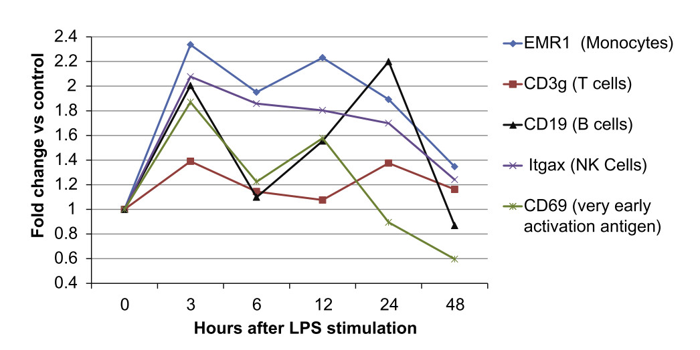

## Motivation

>- Often transcript profiling (microarray, RNA-Seq, etc) experiment are
   conducted, and "differentially expressed" genes are determined based on 
   thresholds for:
    1. Fold change (FC)
    2. p-value
>- Setting a minimum p-value makes sense, but what about the FC requirement?
   There are several possible reasons for setting a minumum fold change.
>- There are at least a couple reasons this is done:
    1. Noisy data collection (ligation, amplification, imperfect sampling)
    2. Assumption that most interested biological effects will involve large
       increases/decreases in transcript levels.
>- However:
    * Are these valid assumptions?
    * What effect do these thresholds have on the loss of biological 
      information?

---

## Approach

---

## Results

Figure 1: Example fold changes for markers of early immune response

---

---

## References

---

